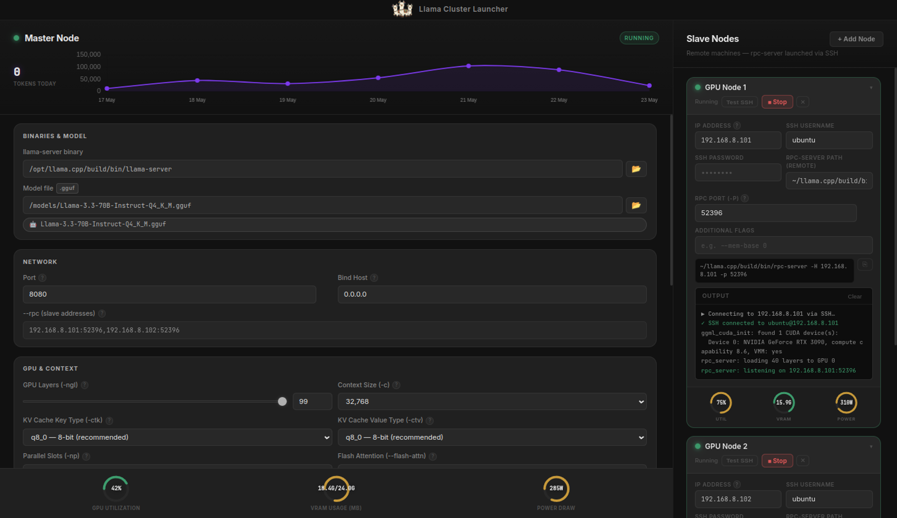

# Llama Cluster Launcher


A professional-grade Electron GUI for managing distributed `llama.cpp` inference clusters. Launch a master inference server locally and connect multiple remote GPU slave nodes via SSH — all from a single interface.


---



*Master node running Llama-3.3-70B-Instruct with two remote RTX 3090 slave nodes connected via SSH. GPU utilization, VRAM, and power draw shown live.*

---

## ✨ Features

- **Master/Slave Architecture**: Manage a local `llama-server` (Master) and multiple remote `rpc-server` instances (Slaves) from one window.
- **SSH Integration**: Connects to remote machines, verifies SSH reachability, and launches processes automatically.
- **Real-time GPU Metrics**: Live dials for GPU Utilization, VRAM usage, and Power draw on all nodes via `nvidia-smi`.
- **Token Tracking**: Live daily token count and 7-day usage graph to monitor your cluster's workload over time.
- **Flash Attention Control**: Fine-grained `--flash-attn` (auto/on/off) for optimized inference.
- **Interactive Flags Explorer**: Click the `?` icon next to Extra Flags to pop open an elegant dictionary of all available `llama-server` arguments.
- **Live Terminal Output**: Real-time stdout/stderr streaming with intelligent log coloring.
- **Port Safety Checks**: Verifies local and remote ports aren't already in use before launching.
- **Encrypted Persistence**: Remembers your config across sessions using AES-encrypted local storage.
- **Command Preview**: Shows the exact `llama-server` / `rpc-server` command before execution — copy it to run manually.

## ⚠️ Security Notice

> **SSH passwords** entered in the GUI are stored locally with AES encryption. For production use, **SSH key-based authentication is strongly recommended** — it is more secure and eliminates the need to store passwords at all.
>
> **RPC traffic** between the master and slave nodes is **unencrypted**. Only run this on a trusted private LAN and firewall your RPC ports. See the [User Manual — SSH & RPC Security](USER_MANUAL.md#9-️-ssh-security--read-this-first) for detailed hardening steps.

## 🚀 Getting Started

### Prerequisites

> **Note on `llama.cpp`**: This launcher manages distributed instances of [llama.cpp](https://github.com/ggerganov/llama.cpp). We strongly recommend cloning the official repository (`git clone https://github.com/ggerganov/llama.cpp`) and building it from source. This is the easiest way to keep your binaries up to date with the latest improvements.

- **Local**: Linux or macOS with [Node.js ≥ 18](https://nodejs.org/)
- **Remote**: SSH access to machines with `llama.cpp` compiled (with CUDA) and `rpc-server` available
- **Hardware**: NVIDIA GPU(s) recommended for `nvidia-smi` metrics and CUDA offloading

### Installation

```bash
# Clone the repo
git clone https://github.com/trojanGoat/llama-cluster-launcher.git
cd llama-cluster-launcher

# Install dependencies
npm install

# Launch
npm start
```

### Usage in 4 Steps

1. **Configure Master** — Select your `llama-server` binary and `.gguf` model file. Tune GPU layers, context size, and KV cache quantization.
2. **Add Slave Nodes** — Click **+ Add Node**. Enter each remote machine's IP, SSH credentials, and path to `rpc-server`.
3. **Launch Slaves First** — Start each slave and wait for `rpc_server: listening on …` in the terminal.
4. **Launch Master** — Click **Launch Master**. Once it shows `HTTP server listening`, your cluster is ready.

📖 **[Read the full User Manual](USER_MANUAL.md)** for complete configuration reference, security hardening, and troubleshooting.

## 🏗 Architecture

```
Local Machine                       Remote Machines
─────────────────────               ────────────────────
Llama Cluster Launcher  ──SSH──▶   rpc-server (GPU Node 1)
        │                          rpc-server (GPU Node 2)
        │ spawns                   ...
        ▼
llama-server (Master)  ◀──RPC──▶  GPU offload (distributed layers)
        │
        ▼
http://localhost:8080  (OpenAI-compatible API)
```

## 🛠 Technologies

| Technology | Role |
|---|---|
| **Electron** | Cross-platform desktop framework |
| **ssh2** | Pure-JS SSH2 client — connects to and manages remote nodes |
| **electron-store** | AES-encrypted local settings persistence |
| **Vanilla CSS** | Custom dark-theme design system |

## 📄 License

MIT License — see [LICENSE](LICENSE).

---

*Built with ❤️ for the LLM community.*
